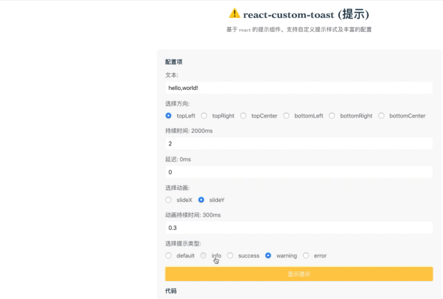

# react-custom-toast

基于 react 的 toast 组件。可以完全的自定义样式。并提供了内置动画与控制方法[demo](https://zhzxang.github.io/demo/react-custom-toast)



### Feature

- [ ] 添加测试
- [x] 上线 demo 网站
- [ ] 更多的内置动画效果

### 安装

> 使用 npm 安装

```
npm install react-custom-toast --save
```

> 使用 yarn 安装

```
yarn add react-custom-toast
```

### 使用

> 添加 ToastContainer 组件至 `render` 中

```js
import { ToastContainer } from 'react-custom-toast'

ReactDom.render(<ToastContainer />, document.body)
```

> 然后，开始使用 toast

```js
import { Toast } from 'react-custom-toast'

Toast.open('hello,world')
```

### 参数

#### ToastContainer

| 参数       | 类型                    | 默认值       | 描述              |
| ---------- | ----------------------- | ------------ | ----------------- |
| component  | `JSX.FunctionComponent` | `undefinded` | 自定义组件        |
| clickClose | `boolean`               | `false`      | 点击 toast 即关闭 |

#### Toast

> 方法

`Toast(msg: string, opt: ToastOption)` // 打开`默认`提示

`Toast.open(msg: string, opt: ToastOption)` // 打开无状态提示

`Toast.info(msg: string, opt: ToastOption)` // 打开提示

`Toast.info(msg: string, opt: ToastOption)` // 打开`成功`提示

`Toast.error(msg: string, opt: ToastOption)` // 打开`错误`提示

`Toast.warning(msg: string, opt: ToastOption)` // 打开`警告`提示

`Toast.remove(id: ToastId)` // 移除某个 toast

#### ToastOption

| 参数            | 类型           | 默认值    | 描述                                                                                                    |
| --------------- | -------------- | --------- | ------------------------------------------------------------------------------------------------------- |
| id              | string\|number | 随机      | 设置 toast id                                                                                           |
| type            | `string`       | ''        | 提示类型('info' \| 'success' \| 'error' \| 'warning')                                                   |
| placement       | `string`       | `topLeft` | toast 方位（'topLeft' \| 'topRight' \| 'topCenter' \| 'bottomLeft' \| 'bottomRight' \| 'bottomCenter'） |
| duration        | `number`       | 2000      | 提示持续时间                                                                                            |
| delay           | `number`       | 0         | 提示出现延时                                                                                            |
| animateDuration | `number`       | 300       | 提示动画时间                                                                                            |
| animateName     | `string`       | `slideX`  | 提示动画效果('slideX' \| 'slideY')                                                                      |

### License

MIT
